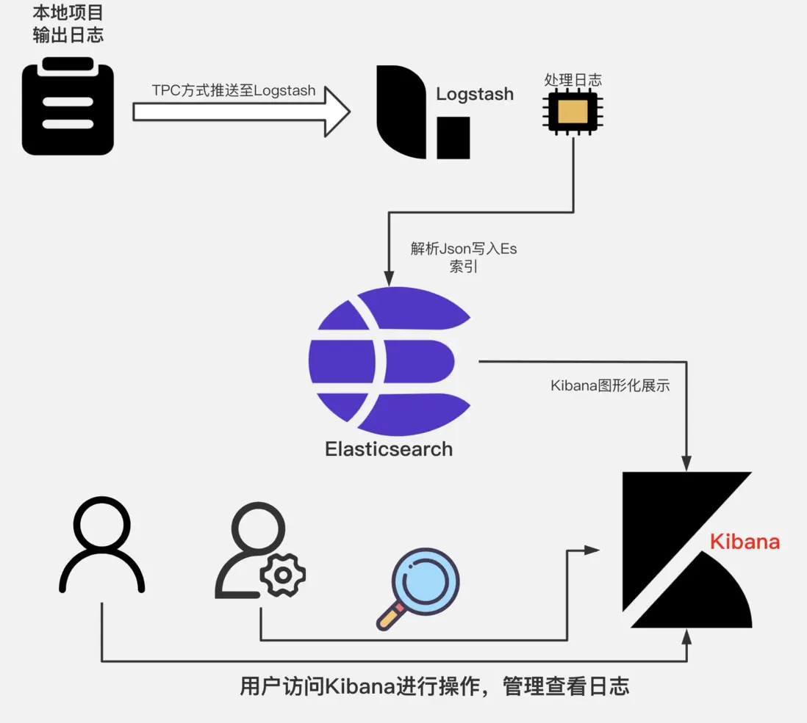

### SpringBoot集成ELK

>ELK官方文档：https://www.elastic.co/guide/en/elasticsearch/reference/current/index.html <br/>
>SpringBoot集成ELK：https://blog.csdn.net/dndndnnffj/article/details/122205168 <br/>
>windows环境部署ELK:https://www.macrozheng.com/mall/deploy/mall_deploy_windows.html#logstash <br/>
>Spring Data Elasticsearch: https://docs.spring.io/spring-data/elasticsearch/docs/4.4.13/reference/html/#preface<br/>

>日志流程:
>logback -> logstash -> elasticsearch -> kibana





#### 1. pom.xml中引入依赖

```xml
<!-- logstash -->
<dependency>
    <groupId>net.logstash.logback</groupId>
    <artifactId>logstash-logback-encoder</artifactId>
</dependency>
<!-- logstash -->
<dependency>
    <groupId>org.springframework.boot</groupId>
    <artifactId>spring-boot-starter-log4j2</artifactId>
</dependency>
<!-- logstash -->
<dependency>
    <groupId>org.springframework.boot</groupId>
    <artifactId>spring-boot-starter-web</artifactId>
</dependency>
<!-- logstash -->
<dependency>
    <groupId>org.springframework.boot</groupId>
    <artifactId>spring-boot-starter-data-elasticsearch</artifactId>
</dependency>
<!-- logstash -->
<dependency>
    <groupId>org.elasticsearch.client</groupId>
    <artifactId>transport</artifactId>
</dependency>
```

#### 2. application.yml中配置logstash

```yaml
spring:
  application:
    name: springboot-elk
  elasticsearch:
    cluster-name: elasticsearch
    cluster-nodes:
    
```

#### 3. 编写logback-spring.xml

```xml
<?xml version="1.0" encoding="UTF-8"?>

<configuration>
    <include resource="org/springframework/boot/logging/logback/defaults.xml"/>

    <springProperty scope="context" name="springAppName" source="spring.application.name"/>

    <appender name="console" class="ch.qos.logback.core.ConsoleAppender">
        <encoder>
            <pattern>${CONSOLE_LOG_PATTERN}</pattern>
            <charset>utf8</charset>
        </encoder>
    </appender>

    <appender name="logstash" class="net.logstash.logback.appender.LogstashTcpSocketAppender">
        <destination>
            localhost:4560
        </destination>
        <encoder charset="UTF-8" class="net.logstash.logback.encoder.LogstashEncoder"/>
    </appender>

    <root level="INFO">
        <appender-ref ref="console"/>
        <appender-ref ref="logstash"/>
    </root>

</configuration>
```

#### 4. 编写测试类

```java
@SpringBootTest
@RunWith(SpringRunner.class)
public class LogTest {
    private static final Logger logger = LoggerFactory.getLogger(LogTest.class);

    @Test
    public void testLog() {
        logger.info("info");
        logger.warn("warn");
        logger.error("error");
    }
}
```

#### 5. 启动logstash

```shell
docker run -d -p 4560:4560 -p 4560:4560/udp -v /Users/zhengwei/docker/logstash/config:/usr/share/logstash/config -v /Users/zhengwei/docker/logstash/pipeline:/usr/share/logstash/pipeline -v /Users/zhengwei/docker/logstash/data:/usr/share/logstash/data --name logstash docker.elastic.co/logstash/logstash:7.2.0
```

#### 6. 启动elasticsearch

```shell
docker run -d -p 9200:9200 -p 9300:9300 -v /Users/zhengwei/docker/elasticsearch/config:/usr/share/elasticsearch/config -v /Users/zhengwei/docker/elasticsearch/data:/usr/share/elasticsearch/data -v /Users/zhengwei/docker/elasticsearch/plugins:/usr/share/elasticsearch/plugins --name elasticsearch docker.elastic.co/elasticsearch/elasticsearch:7.2.0
```

#### 7. 启动kibana

```shell
docker run -d -p 5601:5601 -v /Users/zhengwei/docker/kibana/config:/usr/share/kibana/config --name kibana docker.elastic.co/kibana/kibana:7.2.0
```

#### 8. 访问kibana

```shell
http://localhost:5601
```

#### 9. 创建索引

```shell
PUT /logstash-*
{
  "settings": {
    "number_of_shards": 1,
    "number_of_replicas": 0
  }
}
```

#### 10. 查看索引

```shell
GET /_cat/indices?v
```

#### 11. 查看日志

```shell
GET /logstash-*/_search
{
  "query": {
    "match_all": {}
  }
}
```

#### 12. 查看日志

```shell
GET /logstash-*/_search
{
  "query": {
    "match": {
      "message": "info"
    }
  }
}
```

#### 13. 查看日志

```shell
GET /logstash-*/_search
{
  "query": {
    "match": {
      "message": "warn"
    }
  }
}
```

#### 14. 查看日志

```shell
GET /logstash-*/_search
{
  "query": {
    "match": {
      "message": "error"
    }
  }
}
```

#### 15. 查看日志

```shell
GET /logstash-*/_search
{
  "query": {
    "match": {
      "message": "error"
    }
  },
  "sort": [
    {
      "@timestamp": {
        "order": "desc"
      }
    }
  ]
}
```

#### 16. 查看日志

```shell
GET /logstash-*/_search
{
  "query": {
    "match": {
      "message": "error"
    }
  },
  "sort": [
    {
      "@timestamp": {
        "order": "desc"
      }
    }
  ],
  "from": 0,
  "size": 1
}
```

#### 17. ELK应用场景

- 日志分析
- 数据分析
- 业务监控
- 安全分析
- 业务运营
- 业务分析
- 业务预警
- 业务报表
- 业务决策

#### 18. ES的基本概念

- 索引
- 类型
- 文档
- 字段
- 分片
- 副本
- 节点
- 集群
- 映射
- 倒排索引
- 分词器
- 分析器
- 聚合
- 脚本
- 索引模板
- 索引别名
- 索引生命周期管理
- 索引压缩
- 索引合并
- 索引刷新
- 索引优化
- 索引恢复
- 索引快照
- 索引升级
- 索引删除
- 索引迁移


